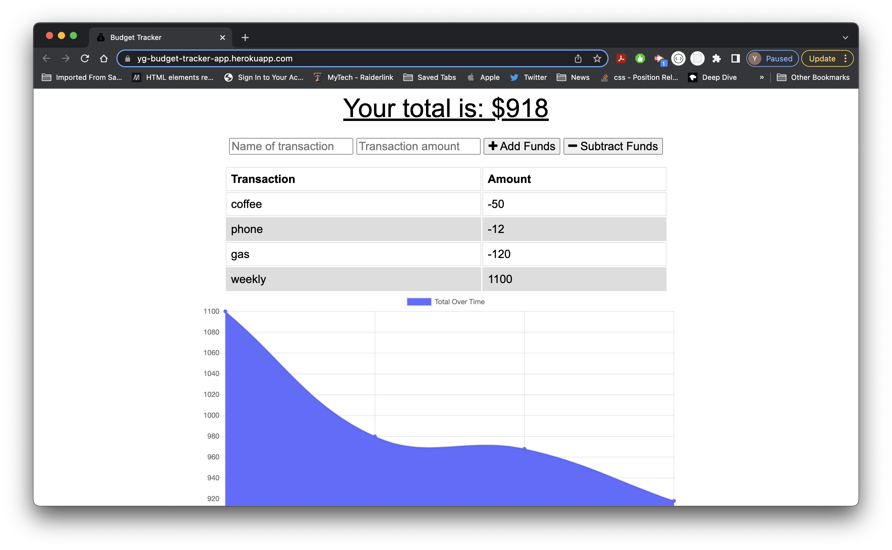

# Budget_Tracker

## Description

This is an application for an avid traveler to track withdrawals and deposits with or without a data/internet connection so the account balance is always accurate when users traveling. The deposits or expenses added while offline are added to the transaction history and totals are updated and when connection is reestablishes user will be notified that they have added an expense or deposit.

## Table of Contents

- [Technologies](#technologies)
- [Installation](#installation)
- [Usage](#usage)
- [Snapshot](#snapshot)
- [Questions](#questions)

## Technologies
The following technologies are used to build this application

- MongoDB 
- mongoose 
- express.js 
- Service worker to store data in IndexedDB while user is offline
- manifest.json to convert the app PWA so user can download the application as an app

## Installation

- Go to the live url in the Usage section and open with Chrome.

- Open the Settings in Chrome.

- Click on Install Images App...

- At the prompt "Install app?", click Install.

## Usage

Track your budget here!

[live URL](https://yg-budget-tracker-app.herokuapp.com/)

## Snapshot

## Contributing

If you like to contribut for this project please follow The Contributor Convenant guidelines.

## Questions

If you have any questions.

Yohans Getaneh

GitHub: https://github.com/yohans14/Budget_Tracker

Email: yohans14@yahoo.com
